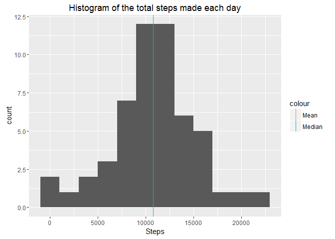
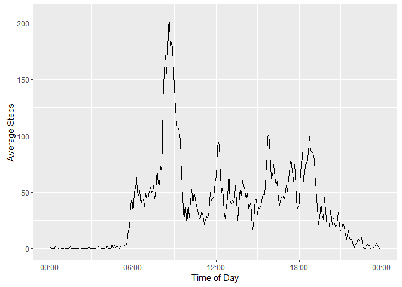
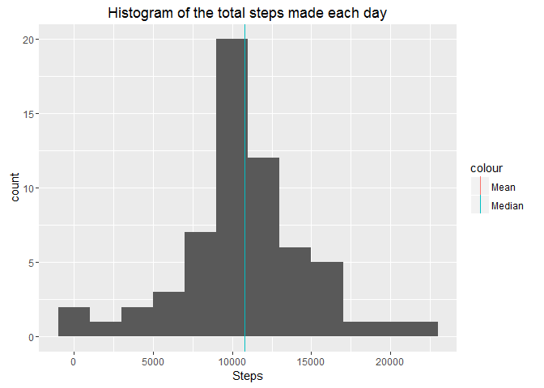
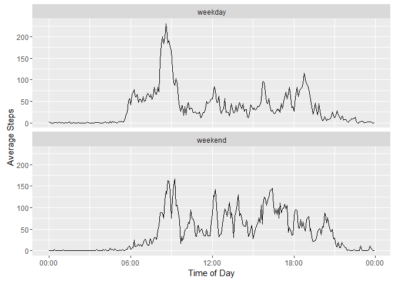

# Reproducible Research: Peer Assessment 1


## Loading and preprocessing the steps
Unzip the steps file and read it in the same line

```r
steps <- read.csv(unz("activity.zip", "activity.csv"), header = TRUE)
```

Convert the *Date* and *Interval* variable into a datetime variable:  

- Add leading zeros to *Interval*. 


```r
steps$interval <- formatC(steps$interval, width = 4, format = "d", flag = "0")
head(steps$interval, 20)
```

```
##  [1] "0000" "0005" "0010" "0015" "0020" "0025" "0030" "0035" "0040" "0045"
## [11] "0050" "0055" "0100" "0105" "0110" "0115" "0120" "0125" "0130" "0135"
```

- Paste the date and interval to one string and parse it with the lubridate function. Save the result in a new variable.
- Use this date to create a time of day variable. Therefore the date is converted to a string containing onl hour and minute and back to the POSIXct format. Now the date for every value is set to the current date.


```r
library(dplyr)
library(lubridate)
```

```r
steps <- steps %>%
  mutate(date = ymd(date), 
         datetime = parse_date_time(paste(date, interval, sep = " "), orders = "ymd hm"),
         time_of_day = as.POSIXct(as.character(datetime, format="%H:%M"), format="%H:%M"))
head(steps$datetime, 20)
```

```
##  [1] "2012-10-01 00:00:00 UTC" "2012-10-01 00:05:00 UTC"
##  [3] "2012-10-01 00:10:00 UTC" "2012-10-01 00:15:00 UTC"
##  [5] "2012-10-01 00:20:00 UTC" "2012-10-01 00:25:00 UTC"
##  [7] "2012-10-01 00:30:00 UTC" "2012-10-01 00:35:00 UTC"
##  [9] "2012-10-01 00:40:00 UTC" "2012-10-01 00:45:00 UTC"
## [11] "2012-10-01 00:50:00 UTC" "2012-10-01 00:55:00 UTC"
## [13] "2012-10-01 01:00:00 UTC" "2012-10-01 01:05:00 UTC"
## [15] "2012-10-01 01:10:00 UTC" "2012-10-01 01:15:00 UTC"
## [17] "2012-10-01 01:20:00 UTC" "2012-10-01 01:25:00 UTC"
## [19] "2012-10-01 01:30:00 UTC" "2012-10-01 01:35:00 UTC"
```

## What is mean total number of steps taken per day?
Calculate the sum of steps per day and the overall mean and median.

```r
stepsperday <- steps %>%
  group_by(date) %>%
  summarise(total_steps = sum(steps))

mean_steps_per_day <- mean(stepsperday$total_steps, na.rm = TRUE)
median_steps_per_day <- median(stepsperday$total_steps, na.rm = TRUE)
```
Plot the steps per day.

```r
library(ggplot2)
```

```r
qplot(stepsperday$total_steps, geom = "histogram", main = "Histogram of the total steps made each day", xlab = "Steps", binwidth = 2000) +
  geom_vline(aes(xintercept=mean_steps_per_day, color = "Mean"), show.legend = TRUE) +
  geom_vline(aes(xintercept=median_steps_per_day, color = "Median"), show.legend = TRUE)
```

```
## Warning: Removed 8 rows containing non-finite values (stat_bin).
```

<!-- -->


The mean is 10766.19 and the median is 10765.


## What is the average daily activity pattern?

Group the data by the time and calculate the average of steps per time interval. Then plot it using ggplot. We give the function to create the x axis a function to convert the breaks into labels.

```r
steps_per_interval <- steps %>%
  group_by(time_of_day) %>%
  summarise(average_steps = mean(steps, na.rm = TRUE))

ggplot(data = steps_per_interval, aes(time_of_day, average_steps)) + 
  geom_line() +
  scale_x_datetime(name = "Time of Day", labels = function(x) as.character(x, format ="%H:%M")) + 
  scale_y_continuous(name ="Average Steps")
```

<!-- -->

```r
max_interval <- as.character(steps_per_interval[steps_per_interval$average_steps == max(steps_per_interval$average_steps), "time_of_day"][[1]], format = "%H:%M")
```
The most avarege steps where taken at 08:35.


## Imputing missing values

How many mising values are there?


```r
sum(is.na(steps$steps))
```

```
## [1] 2304
```
If there is a missing value, we will fill it with the mean of that interval over all days. It comes handy that we calculated this already.


```r
steps <- merge(steps, steps_per_interval, by = "time_of_day")

steps_imputed <- steps %>%
  mutate(steps = ifelse(is.na(steps), average_steps, steps))

steps$average_steps <- NULL

sum(is.na(steps_imputed$steps))
```

```
## [1] 0
```

Now calculate the steps per day with the imputed values.


```r
stepsperday_imputed <- steps_imputed %>%
  group_by(date) %>%
  summarise(total_steps = sum(steps))

mean_steps_per_day_imputed <- mean(stepsperday_imputed$total_steps, na.rm = TRUE)
median_steps_per_day_imputed <- median(stepsperday_imputed$total_steps, na.rm = TRUE)
```


Here is a plot of the steps without imputed values:

```r
qplot(stepsperday$total_steps, geom = "histogram", main = "Histogram of the total steps made each day", xlab = "Steps", binwidth = 2000) +
  geom_vline(aes(xintercept=mean_steps_per_day, color = "Mean"), show.legend = TRUE) +
  geom_vline(aes(xintercept=median_steps_per_day, color = "Median"), show.legend = TRUE)
```

```
## Warning: Removed 8 rows containing non-finite values (stat_bin).
```

<!-- -->

And here with imputed values:

```r
qplot(stepsperday_imputed$total_steps, geom = "histogram", main = "Histogram of the total steps made each day", xlab = "Steps", binwidth = 2000) +
  geom_vline(aes(xintercept=mean_steps_per_day_imputed, color = "Mean"), show.legend = TRUE) +
  geom_vline(aes(xintercept=median_steps_per_day_imputed, color = "Median"), show.legend = TRUE)
```

<!-- -->

Mean and median of both are basically the same with and without imputed values. The main difference is, that there are almost double as many total steps in the 10 000 to 12 000 steps per day range.


## Are there differences in activity patterns between weekdays and weekends?

First of all we mark days as weekdays or weekends. *strftime(date,'%u')* returns a number 1-7 where 6 and 7 are suturday and sunday.


```r
steps_imputed <- steps_imputed %>%
  mutate(daytype = ifelse(strftime(date,'%u') %in% c(6, 7), "weekend", "weekday"))

steps_imputed$daytype <- as.factor(steps_imputed$daytype)
summary(steps_imputed$daytype)
```

```
## weekday weekend 
##   12960    4608
```

```r
head(with(steps_imputed, table(date, daytype)),14)
```

```
##             daytype
## date         weekday weekend
##   2012-10-01     288       0
##   2012-10-02     288       0
##   2012-10-03     288       0
##   2012-10-04     288       0
##   2012-10-05     288       0
##   2012-10-06       0     288
##   2012-10-07       0     288
##   2012-10-08     288       0
##   2012-10-09     288       0
##   2012-10-10     288       0
##   2012-10-11     288       0
##   2012-10-12     288       0
##   2012-10-13       0     288
##   2012-10-14       0     288
```

Now group the data by time of day and daytype to calculate averages. 


```r
steps_imputed_daytype <- steps_imputed %>%
  group_by(time_of_day, daytype) %>%
  summarise(average_steps = mean(steps))
```

Next we plot the values for weekdays and weekends.


```r
ggplot(data = steps_imputed_daytype, aes(x = time_of_day, y = average_steps)) +
  geom_line() + 
  facet_wrap(~daytype, ncol = 1) +
  scale_x_datetime(name = "Time of Day", labels = function(x) as.character(x, format ="%H:%M")) + 
  scale_y_continuous(name ="Average Steps")
```

<!-- -->

We can see that the person is similar active in the morning for each day type, but is more active for the rest of the day on weekends.
